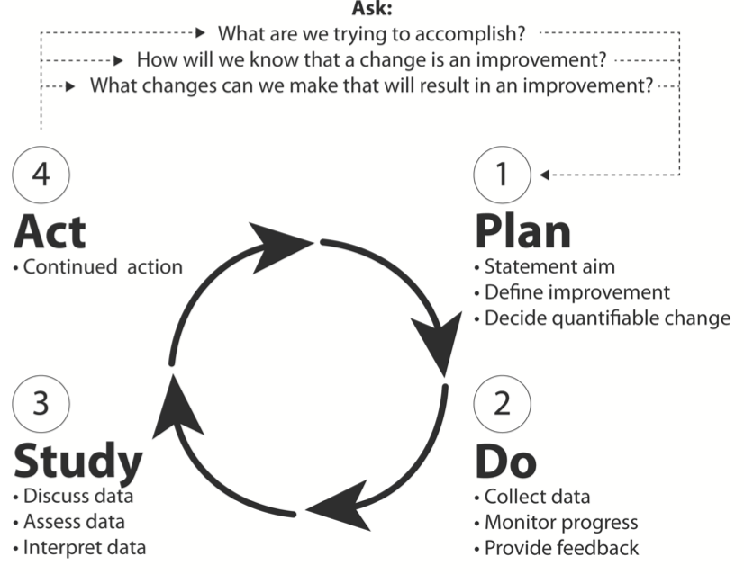

## Clinical audit 

>>It is a quality improvement tool for evaluating and improving patient care and outcomes. This is achieved by systematically reviewing current practices against explicit criteria and measuring the impact of change(s) introduced to generate improvement. 

The clinical audit process can be described by “Plan,” “Do,” “Study,” “Act” phases that comprise an audit cycle.

*Figure 1:The audit cycle, showing the 4 necessary steps of a complete audit cycle, from planning an audit (“Plan”), to the collection and analysis of data (“Do” and “Study”) and identifying steps leading towards improvement (“Act”). The cycle is intended to be repeated with the goal of continuous improvement. Adapted from Langley et al*

### Method

#### Plan

+	Identifying an area  where there are certain standards that need to be met. 
+ Setting evidence based standards for the quality improvement project derived at a Local level – i.e. hospital derived, Regional level or National level 
+	This stage should identify where and how data should be collected.

#### Do
+	Measurement of clinical practice requires:
+	A population to audit: with predefined with inclusion and exclusion criteria.
+	A data collection tool.
+	Once data are collected they must be analysed before implementing change.
	
#### Study
+	This requires comparison of current practice, as collected during stage 2 of the cycle (Measuring), with best practice and identifying areas where change needs to be made.
+	Changes made to practice are often in line with the other key areas of clinical governance, these can include:
+	Education and training
+	Clinical effectiveness
+	Risk management
+	Staffing management
	
#### Act
+	This requires maintenance of the changes to practice in line with best practice standards. Again, this necessitates adherence to the other key components of clinical governance.
+	One of the fundamental parts of clinical audit and sustaining improvement is re-audit. It is often referred to as completing the cycle and entails repeating the stages of clinical audit to provide objective evidence that the improvement is sustained.

### Audit is not research
 + Clinical audit differs from clinical research.
 + Clinical research is focused on establishing an evidence base of what best practice.
 + Clinical audit which aims to ensure that best practice, having been identified through clinical research, is being adhered to and that these standards are being met.
 
